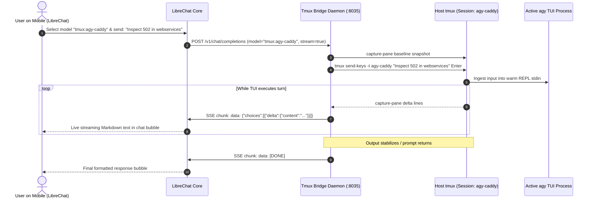
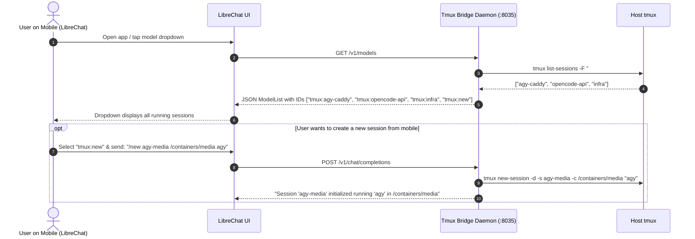
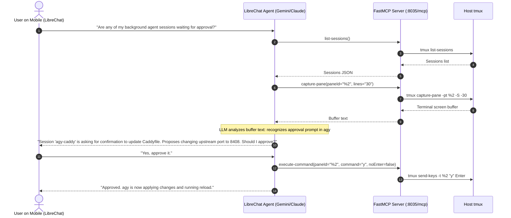

# ARCHITECTURE.md: LibreChatTmuxBridge

Universal bidirectional bridge between **LibreChat (Mobile / PWA)** and **host terminal multiplexers (tmux)** for seamless remote terminal interaction and persistent **AI agent TUIs (Antigravity `agy`, OpenCode)**.

---

## 1. Architectural Philosophy: The "Best of Both Worlds"

Traditional remote management tools force an artificial choice between:
1. **Dumb Terminal Pipes (e.g. Telegram bots, raw SSH clients):** Instant and cheap, but produce unreadable ASCII dumps on phone screens and lack reasoning.
2. **Stateless Agent APIs (e.g. headless task runners):** Highly structured, but cold-start every turn, isolate state from terminal sessions, and burn LLM tokens just to execute shell commands.

**LibreChatTmuxBridge** fuses these into a unified dual-mode system hosted entirely within LibreChat:

| Dimension | Mode 1: Direct Terminal Driver (Pseudo-LLM) | Mode 2: Agentic Copilot (`tmux-mcp`) |
| :--- | :--- | :--- |
| **Backend Route** | `POST /v1/chat/completions` (SSE Stream) | Model Context Protocol (`tmux-mcp`) |
| **Token Cost** | **Zero tokens** (100% free & local) | Standard LLM turn tokens |
| **Latency** | Instant (~50–100ms) | Reasoning delay (2–4s) |
| **Output Format** | Live streaming terminal text inside clean Markdown blocks | Synthesized natural language summary & structured tools |
| **Primary Use Case** | Typing commands into shells, approving TUI prompts, live monitoring | Multi-session audits, cross-project troubleshooting, natural language actions |

---

## 2. Sequence Diagrams

### Sequence A: Direct Terminal Driving (Mode 1)



---

### Sequence B: Dynamic Session Discovery & Spawning from Mobile



---

### Sequence C: Agentic Copilot Mode (Mode 2 via `tmux-mcp`)



---

## 3. The TUI-to-Chat Translation Pipeline

Interactive TUIs (`agy`, `opencode`, `htop`, `vim`) continuously emit VT100 control codes (e.g. cursor positioning `\x1b[H`, line erasure `\x1b[2K`, colors, and alternate-screen swaps).

The bridge processes terminal output through a 3-stage pipeline:

```
┌─────────────────────────────────────────────────────────────┐
│                 Stage 1: Screen Grid Capture                │
│   `tmux capture-pane -pt <session> -S -<history_lines>`     │
│   • tmux resolves cursor addressing and line overwrites     │
│   • Produces an 80-column normalized text buffer            │
└──────────────────────────────┬──────────────────────────────┘
                               │
                               ▼
┌─────────────────────────────────────────────────────────────┐
│                 Stage 2: Delta Line Differ                  │
│   • Compares the new snapshot against the baseline snapshot │
│   • Filters out volatile progress spinners / redraw noise   │
│   • Isolates newly completed text lines, diffs, and prompts │
└──────────────────────────────┬──────────────────────────────┘
                               │
                               ▼
┌─────────────────────────────────────────────────────────────┐
│                 Stage 3: ANSI ➔ Markdown Filter             │
│   • Strips residual control bytes (\x1b[...)                │
│   • Wraps terminal logs and code changes in ```bash blocks  │
│   • Emits standard SSE chunks to LibreChat                  │
└─────────────────────────────────────────────────────────────┘
```

---

## 4. Desktop / SSH Integration (`fzf` Session Picker)

In `~/.bashrc`, an interactive `fzf` menu triggers on SSH login:
- Every session created via LibreChat immediately appears in the menu:
  ```text
  ENTER: Attach/Create | CTRL-N: New | CTRL-R: Rename | CTRL-D: Kill | ESC: Skip
  tmux >
  [+ Create New Session]
  [> Skip to Shell]
  agy-caddy        (1 win, detached)
  opencode-api     (2 win, detached)
  infra            (1 win, attached)
  ```
- Pressing `Enter` runs `tmux attach-session -t <selected>`, dropping the user directly into the active interactive TUI without missing a beat.

---

## 5. Security & Network Boundary

- **Host Port:** `8035` (assigned in accordance with Pipeline Pattern, adjacent to `cli-agent-dispatch` on `8032`).
- **Internal Only:** Bound to `10.0.0.10:8035` or Docker internal network (`net_mcp` / localhost).
- **Authentication:** Accessed exclusively via LibreChat (behind PocketID / TinyAuth SSO on `https://librechat.wileyriley.com`).
- **Safety:** Zero open inbound firewall ports or third-party cloud polling services.
