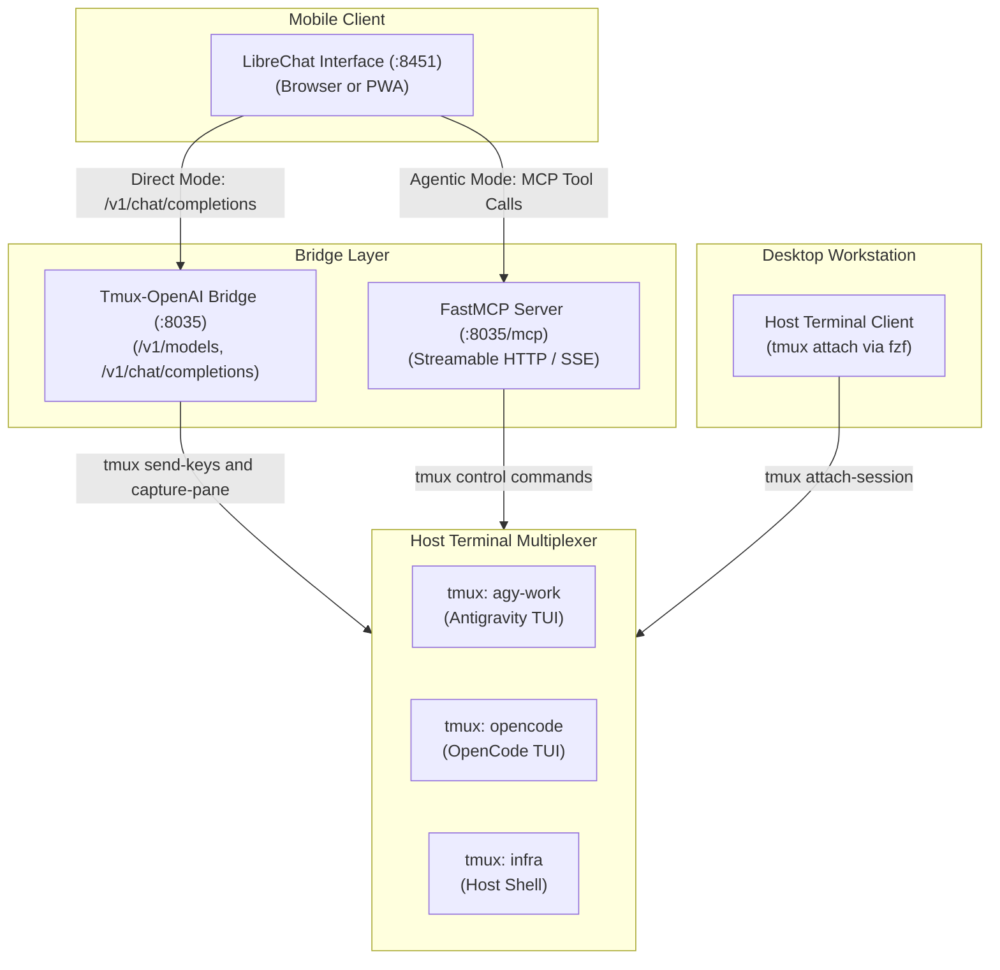

# LibreChatTmuxBridge

[](https://github.com/spelech/LibreChatTmuxBridge/actions/workflows/ci.yml)
[](#test-coverage-and-simulation)
[](https://www.python.org/)
[](LICENSE)
[](https://spelech.github.io/LibreChatTmuxBridge/)

Universal bidirectional bridge between LibreChat and host tmux terminal multiplexers. The bridge provides zero-token terminal streaming and FastMCP agent orchestration for persistent command line sessions and AI agent interfaces.

---

## Technical Overview

Operating terminal sessions from mobile devices using standard SSH clients presents operational constraints:
- On-screen keyboards obstruct terminal display area.
- Control key combinations require complex secondary menus.
- Mobile operating systems terminate background SSH connections during app switches.
- Running agent processes in cold headless subprocesses discards conversational context.

LibreChatTmuxBridge resolves these constraints:
1. **Direct Terminal Streaming:** Uses an OpenAI-compatible `/v1/chat/completions` endpoint to send commands directly to tmux panes with zero token cost.
2. **Dynamic Session Discovery:** Queries `tmux list-sessions` to populate the LibreChat model selector with running sessions.
3. **Session Management:** Creates and terminates detached tmux sessions through interactive slash commands.
4. **Agentic Copilot:** Provides FastMCP tools (`/mcp/sse`) allowing reasoning models to inspect terminal buffers and supervise processes.
5. **Desktop SSH Parity:** Maintains native host tmux sessions, allowing instant attachment from desktop workstations over SSH.

---

## System Topology



---

## Quick Start

### 1. Installation

```bash
git clone git@github.com:spelech/LibreChatTmuxBridge.git
cd LibreChatTmuxBridge
uv sync
```

### 2. Start the Daemon

```bash
uv run librechat-tmux-bridge start --host 0.0.0.0 --port 8035
```

### 3. Connect LibreChat

Add the configuration block to `librechat.yaml`:

```yaml
endpoints:
  custom:
    - name: "Tmux Terminal"
      apiKey: "sk-tmux"
      baseURL: "http://10.0.0.10:8035/v1"
      models:
        default:
          - tmux:new
        fetch: true
      titleConvo: true
      modelDisplayLabel: "Host Tmux"
      dropParams:
        - stop
        - temperature

mcpSettings:
  allowedAddresses:
    - 10.0.0.10:8035

mcpServers:
  tmux-bridge:
    type: sse
    url: http://10.0.0.10:8035/mcp/sse
```

Restart the LibreChat service:

```bash
docker compose restart librechat
```

---

## Built-In Slash Commands

| Command | Usage | Description |
| :--- | :--- | :--- |
| `/list` | `/list` | Display active sessions with window counts and status |
| `/new` | `/new <name> [dir] [cmd]` | Create a detached session on the host |
| `/kill` | `/kill <name>` | Terminate a tmux session |
| `/keys` | `/keys <combo>` | Send control keys (`C-c`, `Escape`, `y`, `Enter`) |
| `/help` | `/help` | Display command reference list |

---

## Test Coverage and Simulation

- **Code Coverage:** Maintained at $\ge 94\%$ statement coverage enforced through `pytest-cov`.
- **Simulation Harness:** 50-turn closed-loop stress test with disturbance injection.
- **Integration Testing:** Direct execution against the host `/usr/bin/tmux` binary.

Run the test suite:

```bash
uv run pytest
```

---

## Technical Documentation

Interactive documentation is hosted on the Agent Preview Hub:
- **Documentation Portal:** [https://spelech.github.io/LibreChatTmuxBridge/](https://spelech.github.io/LibreChatTmuxBridge/)
- [`ARCHITECTURE.md`](ARCHITECTURE.md) — Architectural specifications and pipeline design
- [`REQUIREMENTS.md`](REQUIREMENTS.md) — Traceability matrix and operational constraints
- [`CHANGELOG.md`](CHANGELOG.md) — Version history and release notes
- [`ROADMAP.md`](ROADMAP.md) — Implementation roadmap
