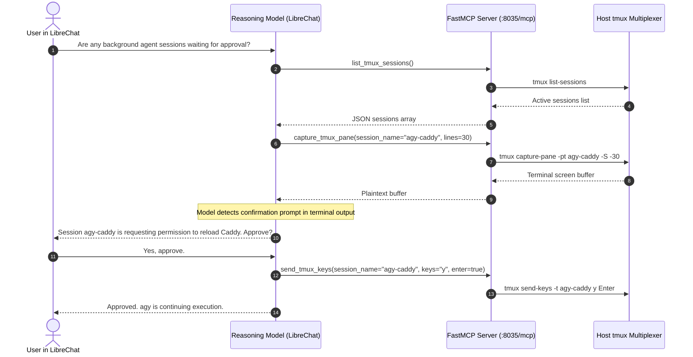

# Agentic MCP Copilot Architecture

The Model Context Protocol (MCP) copilot mode enables external reasoning models (such as Claude or Gemini) to supervise and orchestrate host tmux sessions.

In this mode, LibreChat acts as an intelligent supervisor. The model can inspect active panes across multiple sessions, identify pending approval dialogs, and submit keystrokes on behalf of the user.

## Sequence Flow

## FastMCP Server Capabilities

The bridge implements a FastMCP server over Server-Sent Events (`/mcp/sse`) and HTTP streams.

The server provides these primary capabilities:
1. **Session Inspection:** External agents can query session lists, window identifiers, and attachment states.
2. **Buffer Analysis:** External agents can read arbitrary line counts from the active pane buffer to determine process state.
3. **Keystroke Transmission:** External agents can transmit literal strings or control keys to interact with running programs.
4. **Lifecycle Control:** External agents can spawn new sessions in specified working directories or terminate completed sessions.
