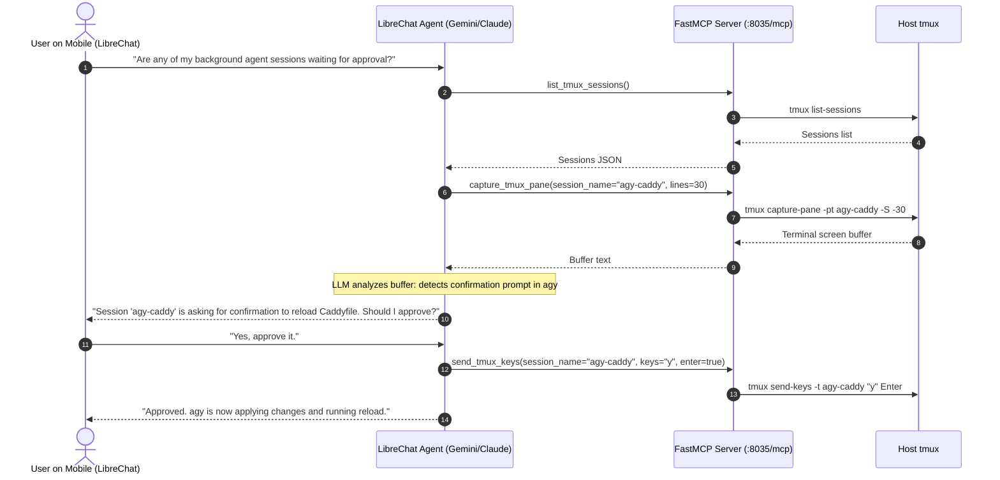

# Agentic MCP Copilot

While Mode 1 gives you instant zero-token driving of individual tmux sessions, **Mode 2 (Agentic Copilot)** lets full reasoning models (Claude 3.7 Sonnet, Gemini 2.5 Flash, DeepSeek V3) orchestrate your homelab and supervise multiple sessions.

---

## 🔄 Interaction Flow

---

## 🛠️ MCP Tools Exposed

1. **`list_tmux_sessions`**: Returns all active host sessions with window counts and attached status.
2. **`capture_tmux_pane`**: Fetches clean terminal scrollback up to `N` lines.
3. **`send_tmux_keys`**: Injects text, commands, or single approval characters (`y/n`).
4. **`create_tmux_session`**: Spawns detached sessions with working directory and optional bootstrap command.
5. **`kill_tmux_session`**: Terminates a session.
6. **`execute_tmux_command`**: Runs arbitrary `tmux` subcommands for advanced scripting.
