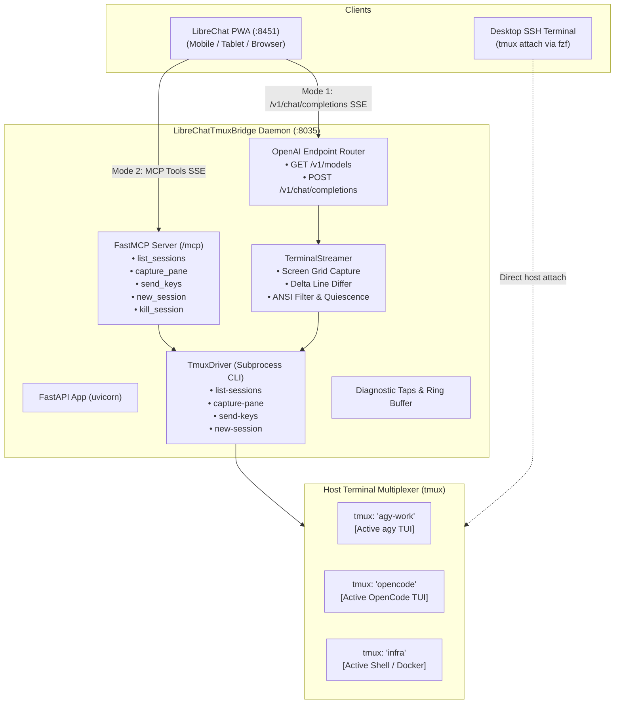

# Architectural Overview

**LibreChatTmuxBridge** resolves the tension between dumb terminal pipes and stateless cloud agent APIs by unifying them into a local, dual-mode bridge.

---

## 🏛️ The Dual-Mode Paradigm

| Dimension | Mode 1: Direct Terminal Driver (Pseudo-LLM) | Mode 2: Agentic Copilot (FastMCP) |
| :--- | :--- | :--- |
| **Backend Route** | `POST /v1/chat/completions` (SSE Stream) | Model Context Protocol (`/mcp/sse`) |
| **Token Cost** | **Zero tokens** (100% free & local) | Standard LLM turn tokens |
| **Latency** | Instant (~50–100ms) | Reasoning delay (2–4s) |
| **Output Format** | Live streaming terminal text inside clean Markdown | Synthesized natural language summary & structured tool calls |
| **Primary Use Case** | Typing commands into shells, approving TUI prompts, live monitoring | Multi-session audits, cross-project troubleshooting, autonomous workflows |

---

## 🏗️ Architectural Topology

---

## 🔒 Security & Network Boundary

- **Host Port:** `8035` (adheres strictly to the Pipeline Pattern decades).
- **Network Scope:** Bound locally to `10.0.0.10:8035` or Docker internal network (`net_mcp`).
- **Access Control:** Guarded behind PocketID / TinyAuth SSO via LibreChat reverse proxy.
- **Zero Cloud Exposure:** No inbound open WAN ports, zero external relay servers.
