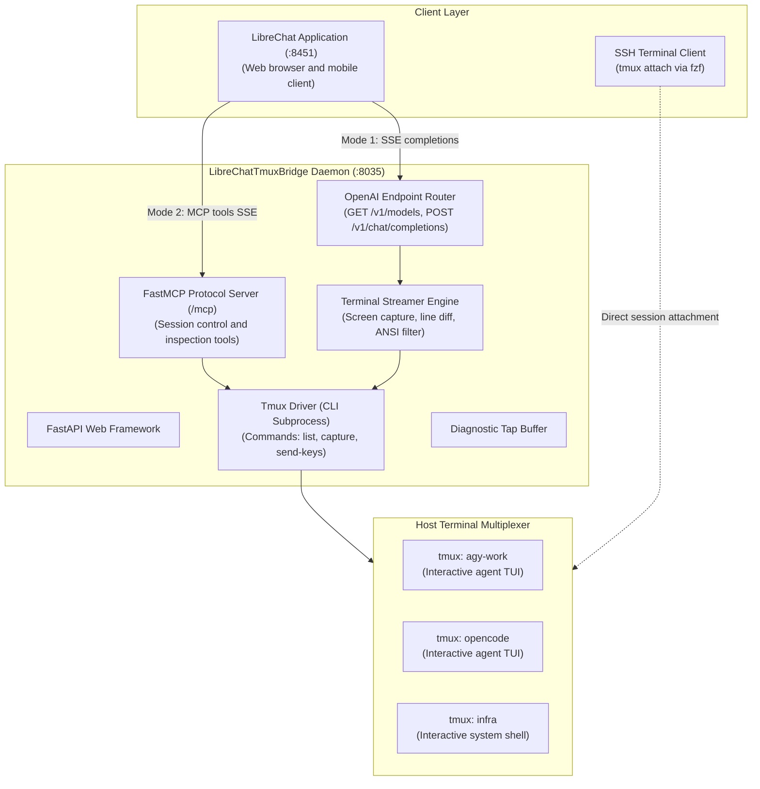

# System Architecture Overview

LibreChatTmuxBridge provides bidirectional communication between LibreChat interfaces and host terminal multiplexers. The system combines direct terminal stream execution with autonomous language model tool orchestration.

## Dual-Mode Operational Paradigm

The bridge operates in two distinct operational modes:

| Dimension | Mode 1: Direct Terminal Driver | Mode 2: Agentic Copilot |
| :--- | :--- | :--- |
| **Backend Protocol** | OpenAI compatible `POST /v1/chat/completions` | Model Context Protocol (`/mcp/sse`) |
| **Token Consumption** | Zero tokens (local execution) | Standard language model generation tokens |
| **Latency** | 50 to 100 milliseconds | Model inference duration (2 to 4 seconds) |
| **Response Format** | Real-time terminal output stream in Markdown | Synthesized natural language with tool calls |
| **Primary Function** | Direct command execution, prompt approvals | Multi-session supervision, autonomous workflows |

## System Topology

## Component Breakdown

1. **FastAPI Web Framework:** Exposes asynchronous HTTP routes and Server-Sent Events (SSE) streams on port 8035.
2. **OpenAI Endpoint Router:** Implements standard `/v1/models` and `/v1/chat/completions` specifications. LibreChat communicates with this router as a standard model provider.
3. **Terminal Streamer Engine:** Captures terminal pane grids, computes line deltas, strips ANSI escape sequences, and monitors terminal quiescence.
4. **FastMCP Server:** Exposes Model Context Protocol tools to enable external reasoning agents to control host sessions.
5. **Tmux Driver:** Executes native `tmux` subprocess commands with non-blocking concurrency and error handling.
6. **Diagnostic Tap Buffer:** Maintains an in-memory ring buffer of recent events, command inputs, and execution latencies for system observability.

## Security and Network Boundaries

- **Host Port Assignment:** The daemon listens on port `8035`, matching the Pipeline Pattern decade conventions.
- **Network Isolation:** The daemon binds to the local host address or internal Docker networks (`net_mcp`).
- **Authentication:** Access is protected through reverse proxy authentication (PocketID and TinyAuth SSO).
- **Network Surface:** The daemon does not expose external ports or relay traffic through third-party services.
