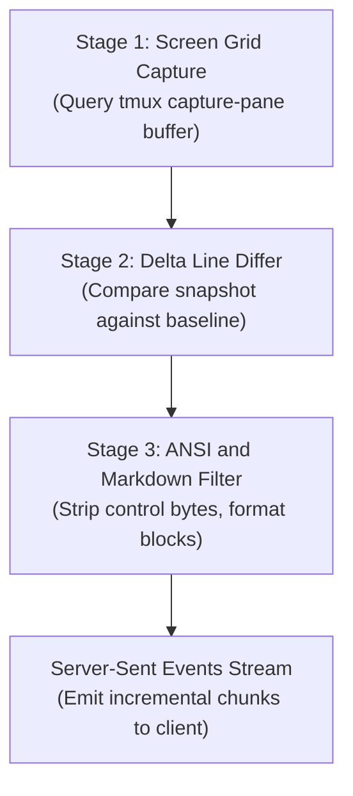

# Terminal Translation Pipeline

Interactive terminal applications such as Antigravity (`agy`), OpenCode, and shell programs emit terminal control sequences:
- Cursor repositioning sequences (`\x1b[H`, `\x1b[2;5f`)
- Line erasure sequences (`\x1b[2K`)
- Alternate screen buffer switches (`\x1b[?1049h`)
- Progress indicators that rewrite identical terminal lines repeatedly

Sending unparsed terminal control sequences to a chat interface produces illegible output. LibreChatTmuxBridge processes terminal streams through a three-stage translation pipeline before message transmission.

## Pipeline Architecture

## Translation Pipeline Stages

### Stage 1: Screen Grid Capture

The driver executes `tmux capture-pane -pt <session> -S -<history_lines>`.

1. The tmux terminal multiplexer parses internal cursor positions, line wrap states, and character overwrites.
2. The capture operation yields a normalized two-dimensional text buffer representing the visible screen and scrollback history.

### Stage 2: Delta Line Differ

The streamer evaluates the new terminal buffer against the initial baseline snapshot.

1. The diff algorithm compares line content from top to bottom.
2. The system filters out repetitive status spinner updates and intermediate redraw frames.
3. The differ extracts newly committed log lines, text outputs, and interactive prompts.

### Stage 3: ANSI and Markdown Filter

The filter sanitizes residual terminal formatting and prepares markdown chunks.

1. A regular expression scanner removes residual escape sequences and control bytes.
2. The engine wraps terminal outputs in fenced code blocks.
3. The streamer formats output lines as JSON payloads matching the OpenAI Server-Sent Events specification.

## Quiescence Detection and Stream Termination

Terminal commands and agent processes do not emit explicit End-of-File markers while the shell session remains open. The streamer uses a quiescence algorithm to detect command completion:

1. The engine captures the baseline scrollback buffer before injecting user keystrokes.
2. The engine samples the terminal pane at regular intervals (`poll_interval_sec`, default 100 milliseconds).
3. When the engine detects new lines, it emits SSE delta chunks and updates the timestamp of the last observed change.
4. When no new output appears for the configured duration (`quiescence_timeout_sec`, default 800 milliseconds), the engine declares the terminal quiescent.
5. The engine transmits the final chunk containing `finish_reason: "stop"` followed by `data: [DONE]`, completing the response stream.
