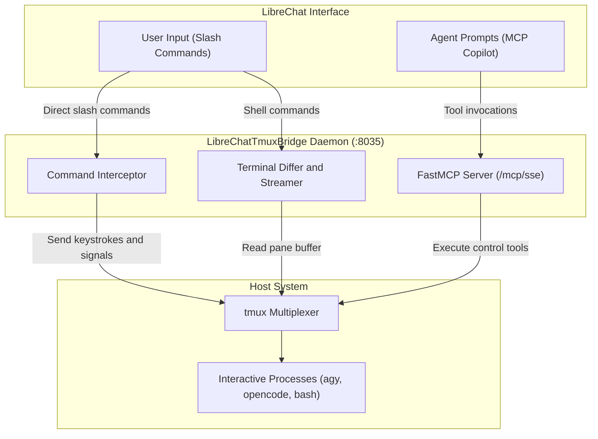

# Slash Commands and Prompt Library

This guide describes the built-in slash commands, the LibreChat prompt library integration, and the FastMCP prompt templates.

## Command Architecture



## Built-In Slash Commands

When communicating with any `tmux:*` model in LibreChat, messages starting with a forward slash (`/`) trigger built-in daemon commands. The bridge intercepts these commands locally and executes them immediately without consuming language model tokens.

### Process Control and Approvals

| Command | Aliases | Function | Sent Keystroke |
| :--- | :--- | :--- | :--- |
| `/approve` | `/y`, `/yes` | Confirm interactive prompt or diff | `y` followed by `Enter` |
| `/reject` | `/n`, `/no` | Decline interactive prompt or diff | `n` followed by `Enter` |
| `/cancel` | `/c`, `/sigint` | Send interrupt signal | `Ctrl+C` (`C-c`) |
| `/enter` | `/return` | Send Enter keystroke | `Enter` |
| `/esc` | `/escape` | Exit mode or cancel dialog | `Escape` |
| `/eof` | | Send End-of-File signal | `Ctrl+D` (`C-d`) |

### Terminal Inspection Commands

| Command | Example | Function |
| :--- | :--- | :--- |
| `/tail [n]` | `/tail 30` | Display the latest *n* lines from the current session pane |
| `/peek <session> [n]` | `/peek remote 20` | Inspect terminal output from another session without switching models |
| `/status` | `/status` | Show daemon health, active session counts, and poll intervals |

### Session Management Commands

| Command | Example | Function | Default Execution |
| :--- | :--- | :--- | :--- |
| `/new [name] [dir] [preset\|cmd]` | `/new dev /containers` | Create a detached tmux session | Starts an interactive shell if no command is specified |
| `/new <name> [dir] agy` | `/new run1 /containers agy` | Start a session with Antigravity | Runs `agy --dangerously-skip-permissions` |
| `/new <name> [dir] opencode` | `/new run2 /containers opencode` | Start a session with OpenCode | Runs `opencode --dangerously-skip-permissions` |
| `/agy [name] [dir] [args]` | `/agy work /containers` | Launch an Antigravity agent | Runs `agy --dangerously-skip-permissions [args]` |
| `/opencode [name] [dir] [args]` | `/opencode dev /containers` | Launch an OpenCode agent | Runs `opencode --dangerously-skip-permissions [args]` |
| `/kill <name>` | `/kill agent-run` | Terminate the specified tmux session | Terminate target session |
| `/list` | `/list` | Show active sessions, window counts, and attach status | Return markdown table |
| `/up` | `/up` | Send Up arrow key and Enter | Re-run last shell command |
| `/down` | `/down` | Send Down arrow key | Navigate command history |
| `/keys <combo> [session]` | `/keys C-z infra` | Send arbitrary key sequence | Send raw tmux keys |
| `/clear` | `/clear` | Clear terminal scrollback buffer | Execute clear command |
| `/help` | `/help` | Show command reference table | Return reference text |

## LibreChat Prompt Library Integration

LibreChat includes a Prompt Library feature accessible from the chat interface. You can seed the LibreChat database to enable autocomplete suggestions when typing `/` in the message input field.

### Seed Database Prompts

Execute the database seeding script from the repository root:

```bash
# Insert the 15 interactive command templates into MongoDB
python3 scripts/seed_librechat_prompts.py

# Remove previously seeded commands
python3 scripts/seed_librechat_prompts.py --clean
```

The script configures three database collections:
- `promptgroups`: Defines command names and descriptions.
- `prompts`: Specifies command templates and variable placeholders (for example, `/peek {{session}} 25`).
- `aclentries`: Sets access control permissions for all authorized users.

## FastMCP Prompts for Autonomous Supervision

When using an external reasoning model in LibreChat, you can activate predefined MCP prompts to supervise background CLI agents:

| MCP Prompt | Purpose | Arguments |
| :--- | :--- | :--- |
| `tmux_launch_agent` | Launch an agent process (`agy` or `opencode`) with bypass permissions | `agent_type`, `session_name`, `start_dir`, `task_goal` |
| `tmux_supervise_agent` | Monitor an agent session, detect confirmation prompts, and summarize progress | `session_name`, `task_goal` |
| `tmux_quick_approve` | Inspect pending confirmation in a target session and send approval | `session_name` |
| `tmux_status_summary` | Query all active tmux sessions and generate a status report | None |
