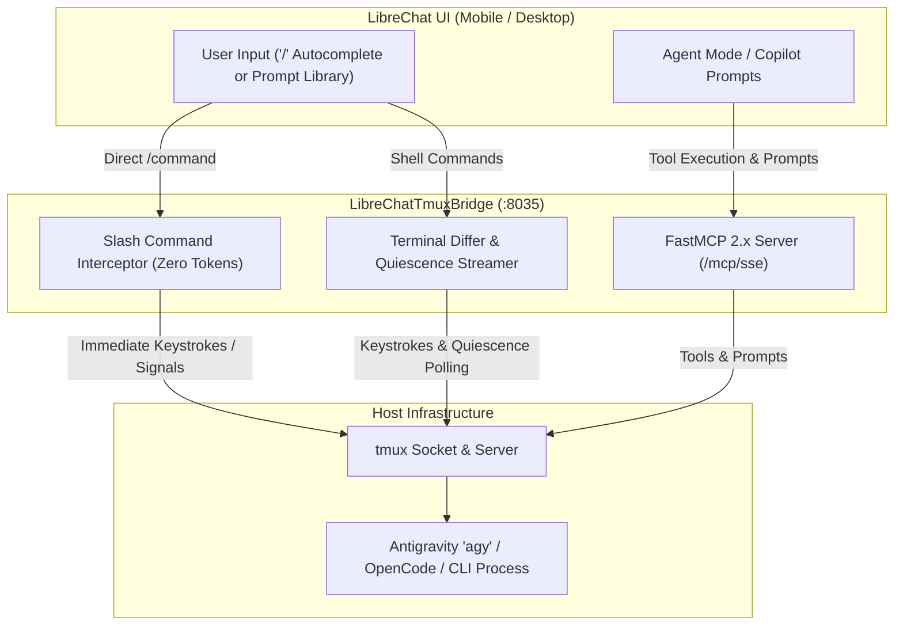

# Interactive Slash Commands & LibreChat Prompt Library

LibreChatTmuxBridge provides a three-tiered command ecosystem engineered for touch-friendly mobile supervision, zero-latency keystroke delivery, and seamless LibreChat integration.

---

## Architecture of Bridge Commands



---

## 1. Built-in In-Chat Slash Commands

When chatting with any `tmux:*` model in LibreChat, messages starting with `/` are intercepted directly by the bridge before sending to any LLM. Execution is immediate, synchronous, and incurs **0 LLM token cost**.

### Quick Approvals & Process Control

| Slash Command | Aliases | Description | Underlying Keystroke |
| :--- | :--- | :--- | :--- |
| `/approve` | `/y`, `/yes` | Confirm CLI prompt or diff | `y` + `Enter` |
| `/reject` | `/n`, `/no` | Decline CLI prompt or diff | `n` + `Enter` |
| `/cancel` | `/c`, `/sigint` | Interrupt long-running command | `Ctrl+C` (`C-c`) |
| `/enter` | `/return` | Submit empty Enter key | `Enter` |
| `/esc` | `/escape` | Cancel modal / exit vi mode | `Escape` |
| `/eof` | | Send End-of-File | `Ctrl+D` (`C-d`) |

### Non-Intrusive Terminal Inspection

| Slash Command | Usage | Description |
| :--- | :--- | :--- |
| `/tail [n]` | `/tail 30` | View the last *n* lines of the current session without typing |
| `/peek <sess> [n]` | `/peek remote 20` | Non-intrusively inspect another tmux session from your current chat |
| `/status` | `/status` | View bridge daemon health, active session counts, and poll intervals |

### Session & Terminal Management

| Slash Command | Usage | Description |
| :--- | :--- | :--- |
| `/list` | `/list` | Show a markdown table of active host sessions, window counts, and attached flags |
| `/new <name> [dir] [cmd]` | `/new agent-run /containers agy` | Spawn a new detached tmux session on the host |
| `/kill <name>` | `/kill agent-run` | Terminate and clean up an active tmux session |
| `/up` | `/up` | Repeat previous shell history command (`Up` arrow + `Enter`) |
| `/down` | `/down` | Send Down arrow key |
| `/keys <combo> [sess]` | `/keys C-z infra` | Send arbitrary special key combinations |
| `/clear` | `/clear` | Send `clear` to clean terminal scrollback buffer |
| `/help` | `/help` | Display interactive command cheatsheet |

---

## 2. Native LibreChat Prompt Library Integration

LibreChat includes a native **Prompt Library** accessible directly in the chat UI. By seeding LibreChat's MongoDB database, typing `/` in the message input automatically displays an autocomplete popup with descriptions and parameter placeholders.

### Seeding LibreChat Prompt Library

Run the automated seeder script:

```bash
# Seed all 13 interactive commands into LibreChat MongoDB
python3 scripts/seed_librechat_prompts.py

# Or remove seeded commands:
python3 scripts/seed_librechat_prompts.py --clean
```

The script configures:
- **`promptgroups`**: Command definitions (`approve`, `reject`, `cancel`, `tail`, `peek`, `list`, `new`, `kill`, `keys`, `up`, `clear`, `status`, `help`).
- **`prompts`**: Command templates with variable insertion (`/tail 25`, `/peek {{session}} 25`, `/keys {{key}}`).
- **`aclentries`**: Configured with both User Owner (`permBits: 15`) and Global Public (`permBits: 1`) permissions so all authorized LibreChat users can invoke them.

---

## 3. FastMCP Agent Prompts

For multi-agent setups where an LLM in LibreChat acts as an autonomous supervisor over CLI agents:

| MCP Prompt | Description | Arguments |
| :--- | :--- | :--- |
| `tmux_supervise_agent` | Supervises a CLI agent, detects confirmation prompts, safely approves/rejects, and provides executive progress reports | `session_name`, `task_goal` |
| `tmux_quick_approve` | Inspects pending confirmation in a target session and issues approval | `session_name` |
| `tmux_status_summary` | Audits all host tmux sessions, captures active panes, and generates an infrastructure dashboard | *(none)* |
