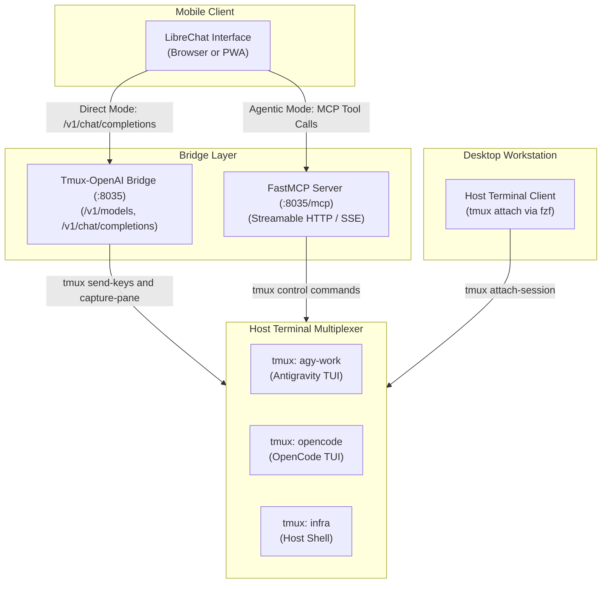

## System Topology



## Operational Example

Send the list command in LibreChat:

```text
/list
```

The bridge returns active session details:

```markdown
### Active Host Tmux Sessions

| Session | Windows | Attached | Active Window |
| :--- | :--- | :--- | :--- |
| `agy-work` | 1 | Yes | agy |
| `infra` | 2 | No | bash |
```
