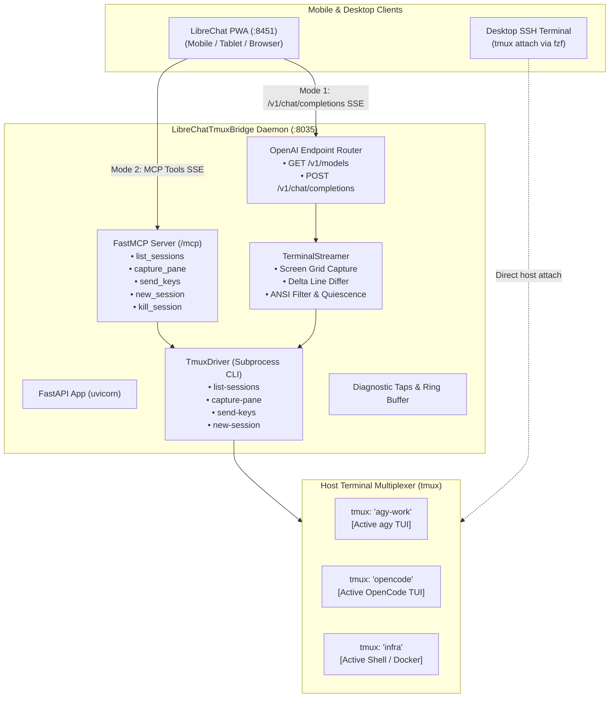

# Design Spec: LibreChatTmuxBridge

**Date:** 2026-09-20  
**Status:** Approved (Goal Execution)  
**Author:** Antigravity / Steven T. Pelech  
**Repository:** `git@github.com:spelech/LibreChatTmuxBridge.git`  
**Target Directory:** `/containers/dev/LibreChatTmuxBridge`

---

## 1. Executive Summary & Problem Statement

Interacting with development environments, Linux servers, and persistent AI agent TUIs (Antigravity `agy`, OpenCode) from mobile devices (iOS/Android) presents acute friction:
- Mobile virtual keyboards obstruct terminal screens; modifier keys (`Ctrl`, `Alt`, `Esc`, `Tab`) require clunky multi-touch toolbars.
- SSH connections drop on lock screen or app switch.
- Headless agent runs discard conversational context and cannot be attached to from desktop.
- Developers need the warm, interactive TUI/REPL of agent processes running 24/7 in `tmux`.

**LibreChatTmuxBridge** bridges this gap by exposing host `tmux` sessions to **LibreChat** through two complementary modes:
1. **Mode 1: Direct Terminal Driving (Zero Tokens):** OpenAI-compatible `/v1/chat/completions` pseudo-LLM endpoint. Messages sent in chat inject into `tmux send-keys`, and terminal output streams back live via Server-Sent Events (SSE) wrapped in clean Markdown.
2. **Mode 2: Agentic Copilot (MCP):** Model Context Protocol server exposing `list_sessions`, `capture_pane`, `send_keys`, `new_session`, and `kill_session` tools to LibreChat agent mode (Claude/Gemini) for multi-session reasoning.

---

## 2. Architecture & Components

---

## 3. Subsystem Breakdown

### 3.1 `TmuxDriver`
- Manages direct execution of `/usr/bin/tmux`.
- Handles session lifecycle: `list_sessions()`, `has_session()`, `new_session()`, `kill_session()`, `capture_pane()`, `send_keys()`, `run_command()`.
- Provides structured `TmuxSession` models with window count, creation time, attached status.

### 3.2 `TerminalStreamer`
- Snapshots pane baseline before injecting input.
- Sends keys with optional `Enter`.
- Implements polling loop with delta diffing to detect new lines, stripped of VT100 control codes and progress spinner redraw noise.
- Detects output quiescence (stable output for > `quiescence_timeout_sec` or prompt character).
- Emits chunks formatted as OpenAI SSE deltas:
  `data: {"choices": [{"delta": {"content": "..."}}]}`
  Terminating with `data: [DONE]`.

### 3.3 Slash Commands
Special in-chat commands executed locally by the bridge without sending raw text to the pane:
- `/new <session> [dir] [cmd]`: Creates a new detached tmux session.
- `/kill <session>`: Terminates a tmux session.
- `/list`: Lists all sessions with status.
- `/keys <keys>`: Sends special keys like `C-c`, `C-d`, `Escape`, `Up`, `Down`.
- `/clear`: Clears the pane scrollback history.
- `/help`: Displays available bridge commands.

### 3.4 MCP Server
Exposes tools via FastMCP over SSE at `/mcp/sse` and HTTP POST at `/mcp/messages`:
- `list_tmux_sessions`
- `capture_tmux_pane`
- `send_tmux_keys`
- `create_tmux_session`
- `kill_tmux_session`
- `execute_tmux_command`

### 3.5 Diagnostic Taps & 6-Part Feedback Envelope
- In-memory ring buffer tracking the last 100 requests, streaming durations, byte counts, and delta events.
- Emits standardized 6-part agent feedback envelope on harness or test failures.

---

## 4. Documentation & VitePress Site

The documentation site is built with **VitePress** and **vitepress-plugin-mermaid**:
- Guides: Getting Started, LibreChat Setup, Mobile Experience, Desktop SSH Parity.
- Architecture: Overview, Translation Pipeline, MCP Copilot.
- Reference: OpenAI REST API, MCP Tools Schema, Configuration Reference, Troubleshooting.
- Live preview hosted on the **Agent Preview Hub** (`preview.wileyriley.com`).

---

## 5. Testing & Verification Gates

1. **Unit Tests**: Mocked `TmuxDriver` verifying ANSI stripping, delta line extraction, slash commands, Pydantic models.
2. **API Tests**: FastAPI `TestClient` verifying `/v1/models`, `/v1/chat/completions` (streaming and non-streaming), and `/health`.
3. **MCP Tests**: FastMCP tool invocation and argument validation.
4. **Controls Simulation Harness**: High-volume closed-loop simulation loop stressing multi-turn interactions, disturbance injection (abrupt disconnects, malformed inputs), and measuring throughput.
5. **Real Tmux Integration Test**: Spawns real temporary tmux sessions on host, sends commands, verifies captured streaming output, and cleans up.
6. **Integrity & Release**: `verify_release.py` verifying markdown links and semver consistency.
7. **Code Coverage**: $\ge 80\%$ enforced via `pytest-cov`.
